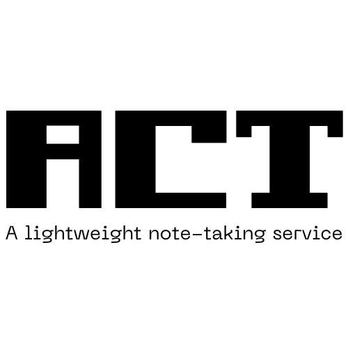

  

# Act Notes

Act note is a RESTful API application providing a simple note-taking service. It allows users to create, read, update, and delete notes. The application is built using Node.js, Express.js, and MongoDB.
